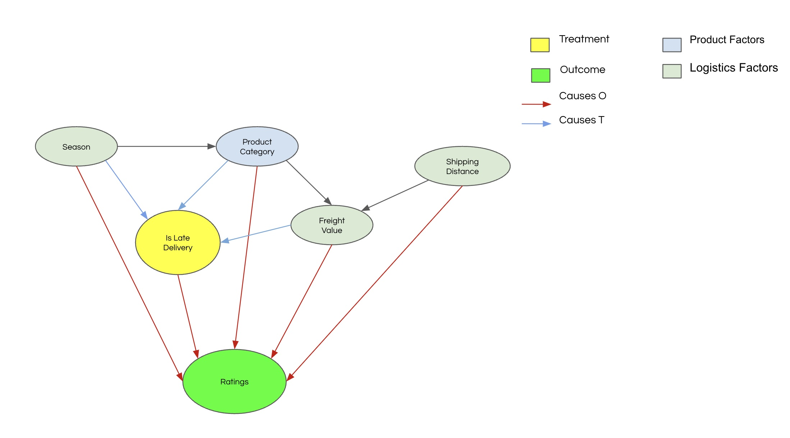
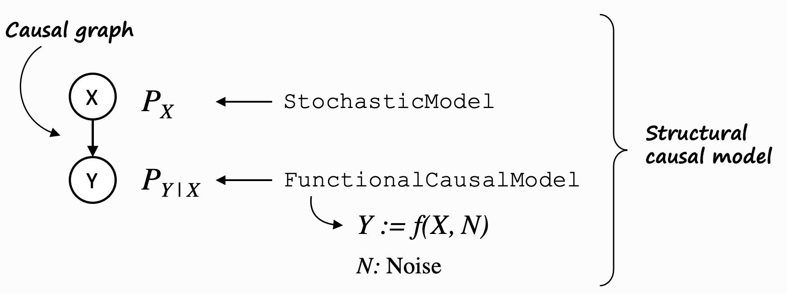

# Olist E-commerce Causal Analysis

## Project Overview
This project investigates the causal effect of delayed delivery on customer satisfaction ratings in e-commerce, using data provided by Olist, the largest department store in Brazilian marketplaces.


## Research Question
Our two research questions are:

1. **What is the causal effect of delayed delivery on customer ratings?**

2. **What is the causal effect of delayed delivery on revenue?**

## Methodology

Our analysis employed two complementary causal inference approaches:



### 1. Propensity Score Matching

Based on the DAG insights, we use propensity score matching to eliminate any variation that may come from our matching variables that may bias our causal effect. Once the variation has been removed and our matching variables are balanced, we are able to effectively estimate the causal effect of late deliveries on customer ratings.

We could define propensity score as the conditional probability of the observation being treated given the matching variables
```
Propensity Score = P(T=1| Matching Variables)
```

**Approach**: 

The first step is to identify our matching variables—this is the identification step. Once these variables are determined, we match observations from the treatment group, where deliveries were late, to those in the control group, where deliveries were on time. By accurately estimating the *Average Treatment Effect on the Treated (ATT)*, we can infer what customer ratings would have been if the deliveries had not been late for the treatment group.

**Causal Estimand Identification**

Based on the DAG, the causal effect is identified through the following estimand:

```latex
P(Rating|is_delivery_late,distance_km,season,Product_category_encoded,freight_value,Product_size)
```

realized estimand
```
Rating~is_delivery_late+distance_km+season+Product_category_encoded+freight_value+Product_size
```

**Matching Variables**:
- Distance (km)
- Season
- Product category
- Freight value
- Product size

**Balance**: 

Achieved comparable covariate distributions between groups

**Results (ATT)**: 

-1.8 stars. On Average a late delivery causes customer ratings to drop by 1.8 stars.

**Notebook**: 

📊 [Propensity Score Matching](notebooks/model-development.ipynb)

### 2. Graphical Causal Modeling

In Graphical Causal Models the goal is to model the data generating process based on what's observed from the DAG we designed. We achieve this by assigning a causal mechanism to each node in the graph.

Here is an example



- **Directed Acyclic Graph (DAG)**: Visualized the causal relationships between variables

- **Key Variables**:
   - Distance (km)
   - Season
   - Product category
   - Freight value
   - Product size

- **Notebook**: 📊 [Graphical Causal Model](notebooks/gcm-development.ipynb)


## Tools and Technologies

Python, DoWhy

## Getting Started

### Prerequisites

- Python 3.7 or higher
- pip (Python package installer)
- Git

### Cloning the Repository

1. Open a terminal or command prompt.

2. Clone the repository using the following command:
   ```
   git clone https://github.com/yourusername/causal-attribution-analysis.git
   ```
   Replace `yourusername` with the actual username or organization name where the repository is hosted.

3. Navigate to the project directory:
   ```
   cd causal-attribution-analysis
   ```

### Setting up the Virtual Environment

1. Create a virtual environment:
   - On Windows:
     ```
     py -3.9 -m venv venv
     ```
   - On macOS and Linux:
     ```
     python3 -m venv venv
     ```

2. Activate the virtual environment:
   - On Windows:
     ```
     venv\Scripts\activate
     ```
   - On macOS and Linux:
     ```
     source venv/bin/activate
     ```

### Installing Dependencies

1. Ensure your virtual environment is activated (you should see `(venv)` at the beginning of your command prompt).

2. Install the required packages using the `requirements.txt` file:
   ```
   pip install -r requirements.txt
   ```

This will install all necessary dependencies for the project.

### Deactivating the Virtual Environment

When you're done working on the project, you can deactivate the virtual environment by running:
```
deactivate
```

## Contributors

## Contributors

- **[Juan Herrera](https://www.linkedin.com/in/juanherreras/)** 
- **[Denisse Wohlstein](https://www.linkedin.com/in/denissewohlstein/)** 
- **[Matteo Mennini](https://www.linkedin.com/in/matteomennini/)** 
- **[Anna Natasha](https://www.linkedin.com/in/anna-natasha/)**
- **[Avantika Gargya](https://www.linkedin.com/in/avantika-gargya/)**
